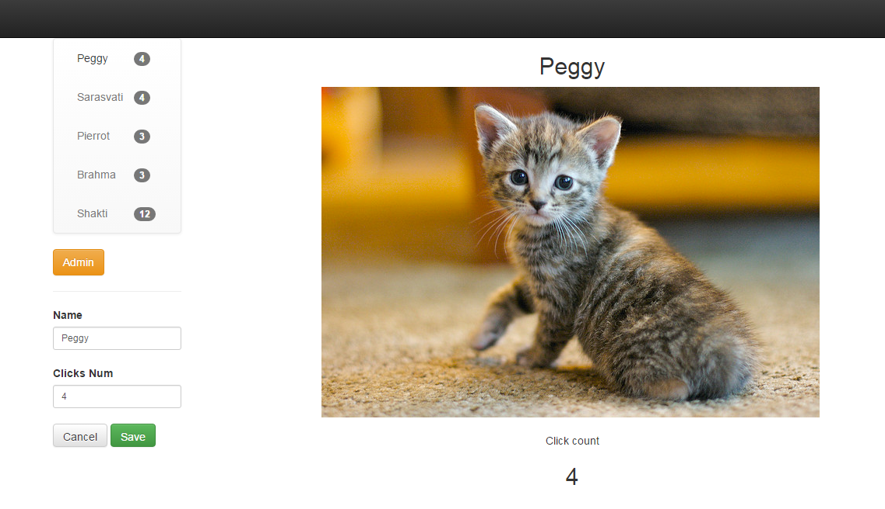

# Cat Clicker

My version of class project [https://www.udacity.com/course/javascript-design-patterns--ud989].
A simple one-page javascript model-octopus-view app.

Clone the repo and open up `index.html` in your browser of choice to start cat-clicking.

